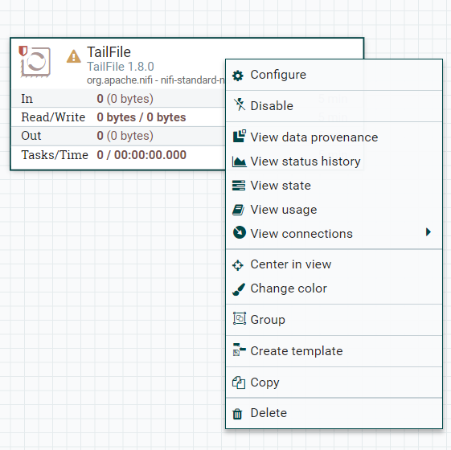
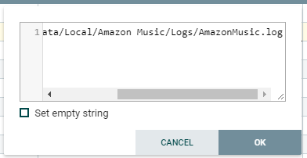
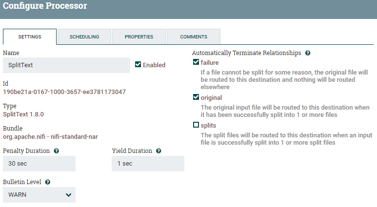
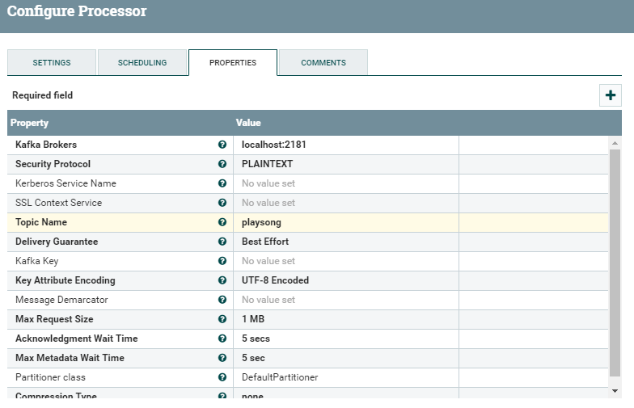
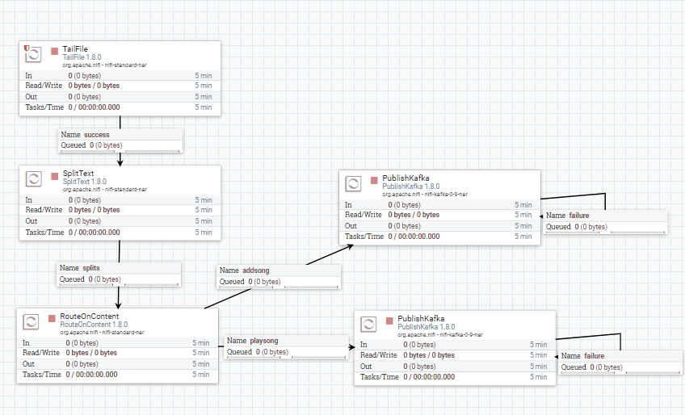

# Apache NiFi Chapter :hand: fa18-523-56

| Daniel Hinders
| dhinders@iu.edu
| Indiana University
| hid: fa18-523-56
| github: [:cloud:](https://github.com/cloudmesh-community/fa18-523-56/blob/master/project-report/report.md)
| code: [:cloud:](https://github.com/cloudmesh-community/fa18-523-56/blob/master/project-code/code)

**:mortar_board: Learning Objectives**

* Learn about NIFI
* Install NIFI and setup a data stream with various processors

---

Keywords: ETL, Data Stream, NiFi, NSA, 

## Apache NiFi Introduction

NiFi is a customizable tool for building flexible data flows while
preserving data provenance and security
[@fa18-523-56-www-nifi-nifihomepage]. NiFi provides the ability to
build or alter an ETL flow with a few clicks. NiFi builds Gets,
Converts, and Pulls in a GUI and allows the user to build and
customize the flow [@fa18-523-56- www-nifi-issartetlsimple]. This
flexibility and usability is key to NiFi's value in a big data world
where stovepipes and inflexibility are frequently challenges.

NiFi is a tool for:

* Moving data between systems, including modern systems such as social
  media sources, AWS cloud server, Hadoop, MongoDB, and so on
  [@www-fa18-523-56-udemy-nifi]
* Delivering data to analytics platforms[@www-fa18-523-56-udemy-nifi]
* Format Conversion, extracting/parsing data[@www-fa18-523-56-udemy-nifi]
* Data or files routing decisions[@www-fa18-523-56-udemy-nifi]
* Real-time data streaming[@www-fa18-523-56-udemy-nifi]


NiFi is not recommended for:

* Distributed Computation[@www-fa18-523-56-udemy-nifi]
* Complex Event Processing[@www-fa18-523-56-udemy-nifi]
* Join/ Aggregated Functions[@www-fa18-523-56-udemy-nifi]

## NiFi History
 
NiFi was first developed at the National Security Agency but was
released as an open source project to the public.

> "NiFi was submitted to The Apache Software Foundation (ASF) in
> November 2014 as part of the NSA Technology Transfer Program"
> [@fa18-523-56-www-nifi-forbes]. 

Since then, Apache Foundation has used its volunteer organization to
grow and mature the project [@fa18-523-56-www-nifi-issartetlsimple].
 
## NiFi Features
 
NiFi incorporates a straightforward User Interface (UI) to engineer
traceable data provence with configurable components. NiFi offers up
the ability to custom build processors and incorporate them into a
highly customizable flows. Through

> "data routing, transformation, and system mediation logic"
> [@fa18-523-56-www-nifi-nifihomepage],

NiFi seeks to automate data flow in a big data environment and gives
architects the ability to keep data flowing between evolving systems
quickly. Amongst a host of features NiFi offers, one sticks out as
particularly important because of the challenges associated with what
the feature addresses: data errors, data inconsistency, and data
irregularity handling. NiFi provides users the ability to incorporate
in the flow processes to catch these non-happy path realities in big
data. As new situations are discovered, a user can quickly
build *if-then* forks in the process to catch, store, or resolve the
data issues.
 
NiFi's main features are:
 
* *Guaranteed delivery*: use purpose-built persistent write-ahead log
  and content repository to ensure guaranteed delivery in an effective
  way[@fa18-523-56-www-nifi-nifihomepage]
[@fa18-523-56-www-nifi-homepagetechdoc].
* *Web-based user interface*: easy to use web-based GUI with drag and
  drop features that allows users to build, schedule, control, and
  monitor data flow[@fa18-523-56-www-nifi-homepagetechdoc]
  [@fa18-523-56-www-nifi-nifihomepage].
* *Provenance*: provide the ability to track data flows through the
  systems with audit trail and traceability functionalities
[@fa18-523-56-www-nifi-homepagetechdoc][@fa18-523-56-www-nifi-nifihomepage].
* *Queue Prioritization*: provide the ability to configure and
  prioritize job flow and determine the order of events
[@fa18-523-56-www-nifi-homepagetechdoc][@fa18-523-56-www-nifi-nifihomepage].
* *Secure*: provide and support multiple security protocols and
  encryptions, as well as authorization management
[@fa18-523-56-www-nifi-homepagetechdoc][@fa18-523-56-www-nifi-nifihomepage].
* *Extensibility*: provide flexibility by allowing pre-built and
  built-your-own extension the be integrated
[@fa18-523-56-www-nifi-homepagetechdoc][@fa18-523-56-www-nifi-nifihomepage].
* *Scalability*: supports scale-out by clustering architecture as well
as scale-up and scale-down
[@fa18-523-56-www-nifi-homepagetechdoc][@fa18-523-56-www-nifi-nifihomepage].


## NiFi Architecture

The NiFi homepage +@fig:nifiarchitecture[fa18-523-56-www-nifi-homepagetechdoc] shows the main components in NiFi architecture.

![NiFi Architecture [@fa18-523-56-www-nifi-homepagetechdoc]]
(images/nifi_architecture.PNG){#fig:nifiarchitecture}

From the top down, NiFi is web browser accessible by a NiFi hosted Web
Server. NiFi processor operations are managed through the Flow
Controller and the three repositories; FlowFile, Content, and
Provenance work to process data on and off disk and in a NiFi flow.
NiFi is hosted in the Java Virtual Machine environment or JVM
[@fa18-523-56-www-nifi-homepagetechdoc].

### Web Server

NiFi's easy-to-use graphic user interface(GUI) is hosted on the Web
Server within the JVM [@fa18-523-56-www-nifi-homepagetechdoc].

### Flow Controller

NiFi central operations hub is the Flow Controller. Treads are managed
and allocated to the processors and the FlowFiles are passed through
and managed through the Flow Controller
[@fa18-523-56-www-nifi-hortontransitpatterns].

### FlowFile Repository

Files in an active NiFi flow are tracked in a write-ahead log so that
as data moved through the flow NiFi can keep track of what is known
about files as they pass
through[@fa18-523-56-www-nifi-homepagetechdoc].

### Content Repository

The real data for a flow file is in the NiFi content repository. NiFi
uses simple blocks of data in a file system to store this FlowFile
data [@fa18-523-56-www-nifi-homepagetechdoc]. Multiple file systems
can be used in order to increase speed with multiple volumes being
utilized.

### Provenance Repository

In NiFi, the provenance repository stores historic event data. The
provenance data about flows is indexed to enable search of the records
[@fa18-523-56-www-nifi-hortontransitpatterns].

### Processors

NiFi provides more than 260 processors and more than 48 controller
services for users to integrate into a flow from the graphic user
interface(GUI) of Nifi[@fa18-523-56-www-nifi-creatingprocessors].
Processors are base on underlying controller services in the java
virtual machine. Controller services can be centered around a security
implementation, database CRUD (create, read, updates, and deletes),
and many other foundational areas. Users can create custom processors
from existing controller services or create a customer controller
service as well [@fa18-523-56-www-nifi-creatingprocessors].

#### Processor Examples

* **Get**

  * Examples: GetFTP, GetMongo, GetTCP, etc
  [@fa18-523-56-www-nifi-homepagetechdoc]
  * Similar input type processors: Consume, Extract, Fetch, Listen, etc

Nifi provides dozens of *Get* processor options and many other similar
input type processors. A *Get* processor is commonly used to pick up a
file or data and launch a FlowFile. The *Get* file processer setup
typically gives configuration options to point to a host, set timing
increments for polling and timeouts, set proxy settings, and more
[@fa18-523-56-www-nifi-homepagetechdoc].

* **Convert**

  * Examples: ConvertJSONToSQL, Convert Record, ConvertExceltoCSVProcessor, etc
  [@fa18-523-56-www-nifi-homepagetechdoc]
  * Similar transformation type processors: Evaluate, Merge, Split, etc. 

Once data is in the flow, NiFi provides dozens of processors to
manipulate or transform data. The *Convert* processors can be
configured to the expected schema or type from the *Get* processor and
transform, edit, thin, enrich, or many other functions on the data in
the flow [@fa18-523-56-www-nifi-homepagetechdoc].

* **Put**

  * Examples: PutFile, PutFTP, PutSQL, PutElasticSearch, PutAzureBlobStorage, etc
  [@fa18-523-56-www-nifi-homepagetechdoc]
  * Similar output type processors: Publish, etc. 

A critical part of a flow in NiFi is pushing the right data out of the
flow into the right spot. There are dozens of *Put* processors that
can be configured to set the directory to write files too. Additional
configuration options are specific to the destination type to include
SSL configuration, cache options, batching options, and many other
configuration options based on the destination type
[@fa18-523-56-www-nifi-homepagetechdoc].

### NiFi Clusters

NiFi can also be integrated with ZooKeeper to operate within a
cluster as shown by +@fig:nificlusterarchitecture
[fa18-523-56-www-nifi-homepagetechdoc] shows how ZooKeeper manages
NiFi's nodes by determining the primary node, Zookeeper Coordinator, and
failover node . Each of the nodes performs the same tasks but
processes different dataset(s) [fa18-523-56-www-nifi-homepagetechdoc].

![NiFi Cluster Architecture [@fa18-523-56-www-nifi-homepagetechdoc]]
(images/nifi_clusters_architecture.PNG){#fig:nificlusterarchitecture}

## Install NiFi


### Apache NiFi - Windows

(Note: Assumes Windows OS and recent verison of Java is installed)

**1**
NiFi can be downloaded from Apache NiFi homepage[@fa18-523-56-nifi-download-page]. Select the latest version and the bin.zip option for the Windows instillation.


{#fig:nifi_download}

**2** Unzip the install package.

**3** Navigate to the configuration directory:
``` 
nifi-1.8.0-bin\nifi-1.8.0\conf
```


{#fig:nifi_config}

Open nifi.properties file with a text editor and edit nifi.web.http.port= to the desired port


```
# web properties #
nifi.web.war.directory=./lib
nifi.web.http.host=
nifi.web.http.port=9090
nifi.web.http.network.interface.default=
nifi.web.https.host=
nifi.web.https.port=
nifi.web.https.network.interface.default=
nifi.web.jetty.working.directory=./work/jetty
nifi.web.jetty.threads=200
nifi.web.max.header.size=16 KB
nifi.web.proxy.context.path=
nifi.web.proxy.host=
```

**4** Start up NiFi by navigating to

``` 
nifi-1.8.0-bin\nifi-1.8.0\bin
```


{#fig:nifi_bin}

Run the windows batch file

``` 
run-nifi.bat
```
Wait about 5 minutes for NiFi to load

**5** Open the NiFi GUI by opening a browser and navigate to

```
http://localhost:9090/nifi
```


{#fig:nifi_nifihome}

## Building a NiFi Flow

**1** Add a TailFile Processor by clicking and draging the processor icon fron the top tray to add a processor.
Type into the filter "tail" and select the TailFile processor and click ADD


{#fig:nifi_processor_tailfile}

**2** Configure the TailFile Processor by right-clicking on the process and click configure.


{#fig:nifi_processor_config}

Click the properties tab and click the value for the property "File(s) to Tail"

A box will appear to paste the location of the file to tail. For this example I will use a log file for a music player because it will provide a lot of data.

Use / slash when inputing file path

```
/AppData/Local/Amazon Music/Logs/AmazonMusic.log
```


{#fig:nifi_tailfile_config}

Click OK and then click APPLY

**3** Add a processor called SplitText

Open the configuration options for the processor and on the settings tab in the options for Automatically Terminate Relationships check the boxes "failure" and "original"


{#fig:nifi_splittext_config2}


```
NOTE
This provides direction if there is a failure at this step if a 
file can't be split any what to do with the original file after 
it is split. This flexiablity that NiFi provides requires extra 
configuration choices but provides the NiFi admin extensive 
control over every aspect of the flow being built.
```

Click the properties tab and change the property Line Split Count to a value of "1"


{#fig:nifi_splittext_config}

This will split each line of the log file into one row that will be processed independently in the rest of the flow.

**4** Add a processor called RouteOnContent 

Open the configuration options for the processor and on the settings tab in the options for Automatically Terminate Relationships check the box "unmatched" 

Click the properties tab and change the property Match Requirement to "content must contain match" click OK

Click the + in the upper right corner to add a property. 

```
NOTE
This property will be used to select a word or pharse from 
the rows of the log file. When the word is seen in the row
the content of the row will be routed down stream. For this
example we will use "AddToLibrary" when a user in the music
player adds a song to the library. We will 
use "ClientImplWinHTTP.cpp:525" which is the tag in the log 
when a song plays in the music player
```

After naming the new property click OK

Click on the value and use the NiFi expression language insert the tags to use to select the rows for processing. 

```
NOTE
The NiFi experssion language can be found on the Apahce NiFi 
website[@fa18-523-56-www-nifi-expressionlanguageguide].
```

We will use these tags for our new properties:

```
\bAddToLibrary\b
\bClientImplWinHTTP.cpp:525\b
```


{#fig:nifi_routeoncontent_config}

Once all properties have been added click APPLY

**5** Link the processes by hovering over the TailFile processor click on the arrow that appears and drag to connect it to the SplitText Processor


{#fig:nifi_flow1}

A window will appear to create the connection. Click ADD to connect the processors


{#fig:nifi_flow2}

Connect the SplitText Processor to the RouteOnContent processsor

Configure the connection in the column For Relationships, check the box "splits" 


{#fig:nifi_connection1}

```
NOTE
This configuration for this connection will route the rows we selected 
from the log file that were split out. Another path could be created to 
handle the orginal files or the failures.
```
**6**

Right click on the RouteOnContent processor to open the configuration options for the processor and on the settings tab in the options for Automatically Terminate Relationships check the boxes "playsong" and "addsong" and click APPLY.


The flow is now complete, it will read a log file, select and split inputs into rows based on parameters and routes the selected rows for output. But we have choosen to terminate the output at the RouteOnContent processor so that we run this simple flow first before connecting the flow to an external consumer. 


{#fig:nifi_flow3}

Select all five components in the flow with the shift key held down, then right-click on any component and select Create template.

Type a name for the template and click CREATE.

Click and drag the Template icon fron the top tray to add to the workspace and a diologe box will ask what template to add and you can select the template that was just saved. 


**7** To run our completed flow we need to turn on individual components or start then all at once. 

Select all components with the shift key held down and click on the play button on the operate panel on the left side of the workspace.


{#fig:nifi_operate}

After a few seconds right-click anywhere in the workspace and click refresh.

There is will statistics on each processor for data flowing through the flow.


{#fig:nifi_flow4}

## Linking NiFi Flow to Apache Kafka

NiFi provides numerous endpoint processors pass data out of the NiFi flow to a new host. One example is Apache Kafka, these directions for setting up Kafka are for Windows.

**1** Start setting up Apache Kafka by download the lastest version of Kafka from the Apache Kafka website. The download will include Apache ZooKeeper. 

**2** Configure Zookeeper and Kafka by navigating to the configuration directory:

```
kafka_2.11-2.0.1\kafka_2.11-2.0.1\config
```
Open zookeeper.properties file with a text editor and edit clientPort= to the desired port and the dataDir= to the desired folder for logs

```
clientPort=2181
clientPortAddress=localhost
```
Open server.properties file with a text editor and edit zookeeper.connect= to the port selected for zookeeper and the dataDir= to the desired folder for logs

```
zookeeper.connect=localhost:2181
```

**3** Start the ZooKeeper server by opening cmd prompt and set directory to
```
\kafka_2.11-2.0.1\kafka_2.11-2.0.1\bin\windows
```

type:
```
zookeeper-server-start.bat c:\(path)\kafka_22.11-2.01\config\zookeeper.properties
```
Hit enter and the ZooKeeper server will start up


{#fig:nifi_zookeeper_startup}

**4** Start Kafka server by opening another cmd prompt and set directory to 
```
\kafka_2.11-2.0.1\kafka_2.11-2.0.1\bin\windows
```
type:
```
kafka-server-start.bat c:\(path)\kafka_22.11-2.01\config\server.properties
```

Hit enter and the Kafka server will start up


{#fig:nifi_kafka_startup}

**5** Create two Kafka topics to so that we can put files data from the NiFi flow into the Kafka topics

To add the addsong topic open a new cmd prompt and set directory to
```
\kafka_2.11-2.0.1\kafka_2.11-2.0.1\bin\windows
```

type:
```
kafka-tpocs.bat --create --zookeeper localhost:2181 --replication-factor 1 --partitions 1 --topic addsong
```
[@fa18-523-56-www-nifi-kafkastartup]

Hit enter and the new topic will be created


{#fig:nifi_kafka_addtopic}

Repeat to add the  process type: 
```
kafka-tpocs.bat --create --zookeeper localhost:2181 --replication-factor 1 --partitions 1 --topic playsong
```

**6** Add NiFi Processors to push data from the NiFi flow to Kafka

Select all three processors with the shift key held down and click on the stop button on the operate panel on the left side of the workspace.


{#fig:nifi_operate}

Add a PublishKafka processors to the flow. On the settings tab check the success check box.
On the properties tab provide the port for the Kafka Broker.

```
localhost:2181
```
On the properties tab provide the Topic Name: addsong

Repeat this process by adding another PublishKakfa processor and configure it the same except set the Topic Name: playsong



{#fig:nifi_publish_kafka_config}

**6** Configure the RouteOnContent processor, on the settings tab in the options for Automatically Terminate Relationships uncheck the boxes "playsong" and "addsong" and click APPLY.


{#fig:nifi_routeoncontent_config_kafka}


**7** Link the RouteOnContent processsor and a PublishKafka processor by hovering over the RouteOnContent process and click on the arrow that appears and drag to connect it to the PublishKafka Processor

The Create Connection settings will appear, For Relationships, check the approporate topic being used by the PublishKafka processor that is linked, addsong, or playsong. Repeat the link from the RouteOnContent processor and the other PublishKafka processor and check the correct relationship.


{#fig:nifi_kafka_linked}

```
NOTE
Hover over the yellow exclimation point on one of the PublishKafka processors. The error will say "'Relationship failure' is invalid because Relationship 'failure' is not connected to any component and is not auto-terminated" This is a good example of the robust validation in NiFi to ensure flows have the proper fail-over properties in place.


{#fig:nifi_kafka_error}
```

**8** To create a pathway for any data that fails in the PublishKafka processors hover hovering over the PublishKafka processor and click on the arrow that appears and drag to connect it with itself.

The Create Connection settings will appear, For Relationships, check the failure box.


{#fig:nifi_kafka_fail}

Repeat for the other PublishKafka processor.

The flow is ready to run. 

{#fig:nifi_kafka_finalflow_notrun}


Select all processors while holding down the shift key, right click on any of the processors and click start.


{#fig:nifi_kafka_finalflow_run}

Data from the selected rows of the log files are flowing all they way through the NiFi flow to the Kafka cluster.

### 


## Alternatives to NIFI


## Conclusion

## Acknowledgement


Batch vs Live stream (Live)
 
Theory
Implementation (e.g. Python)
Benchmark
A more detailed outline is
Paper
Title
Abstract
Introductions
Requirements
Architecture
Implementation
Benchmark
Conclusions
Bibliography
Work breakdown


